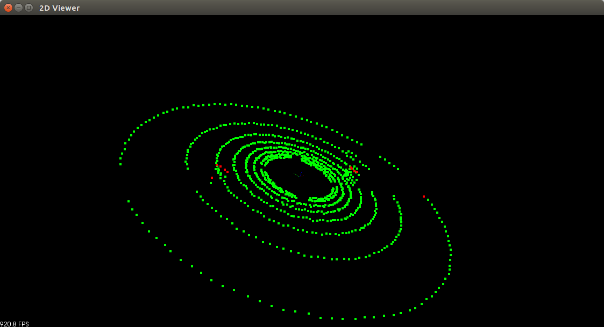
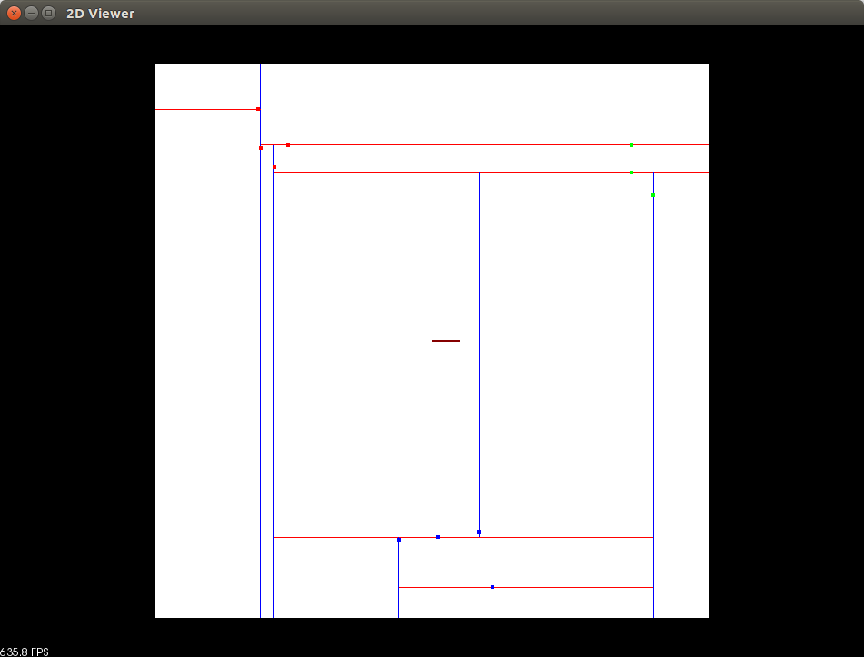
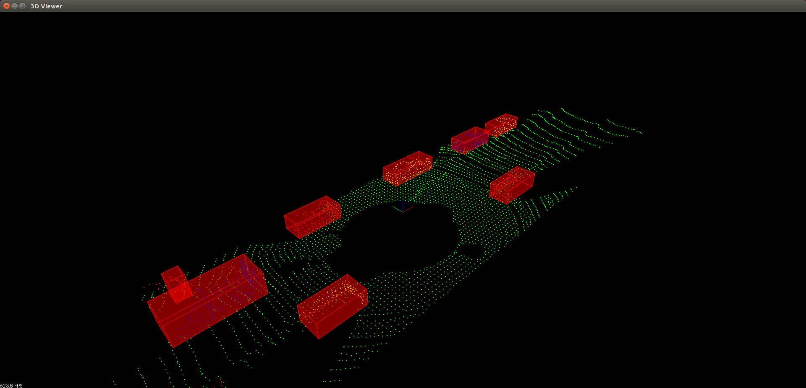

# Sensor Fusion Self-Driving Car Course

# CORE CURRICULUM (2): Lidar Obstacle Detection 

## 1. Results of Quiz and Project

### 1) Result of Quiz 1 (RANSAC)

### 2) Result of Quiz 2 (Clustering)

### 3) Result of Data1 in the Project 1 (SFND_Lidar_Obstacle_Detection)

<!--

(click on the image to open the video)
-->
